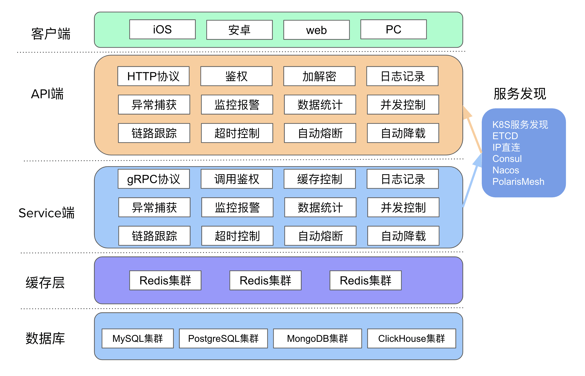

# go-zero


## 基础介绍

go微服务框架




### 项目结构


#### api项目
```yaml
api项目:
    /etc: # 配置
        xxx-api.yaml:
    /internal: # 
        /config:
            config.go: # 配置，持有xxx-api.yaml配置
        /handler:
            xxxhandler.go: # 处理函数定义，仅进行参数绑定、上下文传递
        /logic:
            xxxlogic.go: # 生产的service方法，实际路由逻辑处理函数
        /svc:
            servicecontext.go: # 上下文，持有配置RestConf
        /typs:
            types.go: # 生成的消息结构体
    xxx.api: # api定义文件
    xxx.go: # 主运行文件
```

### goctl
```yaml
goctl:
    -h:
    -v:
    api: # Http服务
        go: # 根据api文件生成go代码
            -api:
            -dir:
        new:
    bug:
    completion:
    docker:
    env:
    help:
    kube:
    migrate:
    model:
    quickstart:
    rpc: # RPC服务
        new:
        protoc:
            --go-grpc_out:
            --go_out:
    template:
    upgrade:
```

微服务代码生成工具

#### api
```yaml
.api:
    syntax: # 语法版本
        v1:
    info: # api信息
        desc:
        title:
        version:
    type: # 消息定义
        string:
    @server:
        group:
        jwt:
        maxBytes:
        middleware:
        prefix:
        timeout:
    service: # 服务定义
        @handler: # 方法名定义
        get: # 请求定义
        post:
            returns:
```
go-zero特殊格式文件


#### proto
```yaml
.proto:
    syntax:
        proto3:
    package:
    option:
        go_package:
    import: # 导入其它proto
    enum: # 枚举定义
    message: # 消息定义
    service: # 服务定义
        rpc: # 方法定义
            stream: # 流式
            returns:
```


## 核心内容
```yaml
go-zero:
    core:
        conf: # 配置
            MustLoad():
        logx:
    gateway: # 网关
        GatewayConf:
        HttpClientConf:
        Option:
        RouteMapping:
        Server:
            Starp():
            Stop():
        Upstream:
        MustNewServer():
    rest: # http api
        httpx:
            ErrorCtx():
            OkJsonCtx():
            Parse(): # 请求解析、绑定
        Middleware:
        MiddlewareConf:
        RestConf: # http配置
        Route: # 路由类
            Handler: # 处理函数
            Method:
            Path:
            WithMiddleware():
            WithMiddlewares():
        RouteOption:
        RunOption: # 运行配置
            WithChain():
        Server: # api 服务类
            AddRoutes(): # 添加路由
            Start():
            StartWithOpts():
            Stop():
            Use():
        MustNewServer():
        NewServer(): # 新建服务
    tools:
    zrpc:
```


